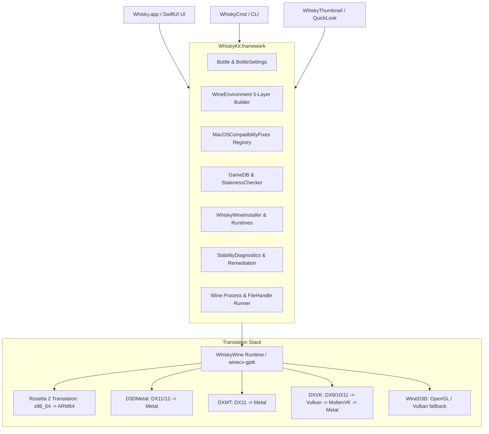

# AGENTS.md — System Architecture, Runtime Invariants & Agent Guidelines

> **Target Audience:** Autonomous Coding Agents, Subagents, and Human Systems Engineers  
> **Repository:** `dappermint/Whisky` (Whisky Preview / WhiskyKit / WhiskyCmd)  
> **Primary Platforms:** macOS 26.0+ (Tahoe and later), Apple Silicon (`arm64` / `arm64e`)  
> **Core Subsystems:** Swift 6 Concurrency, SwiftUI, Wine Staging / WhiskyWine (`winecx-gptk`), Rosetta 2, D3DMetal (GPTK), DXMT, DXVK, MoltenVK

---

## 1. Mission & System Overview

**Whisky** is an advanced, native macOS graphical management and execution platform for Windows applications and games on Apple Silicon. Rather than running a heavyweight virtual machine or emulation container, Whisky orchestrates **Wine** (specifically customized **WhiskyWine** builds derived from CrossOver source trees and Wine Staging) coupled with Apple's **Rosetta 2** translation runtime and low-level graphics translation layers.

### The Problem Space
Running modern x86_64 Windows executables with DirectX 11/12 graphics on Apple Silicon macOS requires coordinating three distinct translation tiers:
1. **CPU Instruction Translation:** Translating x86_64 instructions to ARM64 instructions at runtime.
2. **Operating System & ABI Translation:** Emulating Windows NT kernel APIs, user-mode win32/win64 DLLs, PE binary loading, process trees, and POSIX/Mach system call mappings.
3. **Graphics & Audio Translation:** Converting Direct3D (D3D9/10/11/12) draw calls and shaders into Apple Metal shading language (MSL) and Metal execution pipelines, while bridging Windows CoreAudio/DirectSound into macOS CoreAudio.

Any agent modifying this repository must respect the intricate interdependencies between the Swift management layer, the Darwin kernel, the Rosetta 2 translator, and the Wine runtime.

---

## 2. Platform & Hardware Invariants (Non-Negotiable)

### 2.1 Strict Apple Silicon (`arm64`) Requirement
- **Intel Macs are unsupported.** Whisky requires an Apple Silicon host CPU (`arm64` / `arm64e`).
- **Detection Invariant:** Never use `#if arch(arm64)` to detect host architecture in runtime code. Under Rosetta 2, an x86_64 slice executing on Apple Silicon will have `#if arch(arm64)` evaluate to `false` and `sysctl(hw.machine)` report `x86_64`.
- **Authoritative Check:** Always inspect [`HostArchitecture.isAppleSilicon`](file:///Users/niltonperimneto/Whisky/WhiskyKit/Sources/WhiskyKit/Utils/HostArchitecture.swift#L26-L34), which queries `hw.optional.arm64` via `sysctlbyname`:
  ```swift
  public enum HostArchitecture {
      public static let isAppleSilicon: Bool = {
          var value: Int32 = 0
          var size = MemoryLayout<Int32>.size
          let result = sysctlbyname("hw.optional.arm64", &value, &size, nil, 0)
          return result == 0 && value == 1
      }()
  }
  ```
- **Unified Memory Rationale:** D3DMetal and DXMT rely on Apple Silicon unified memory for zero-copy CPU/GPU buffer sharing between Wine's virtual address space and Metal device textures.

### 2.2 Rosetta 2 Runtime Requirement
- Whisky's Wine runtimes (`wine64-preloader`, `wineserver`, and PE loaders) are compiled as `x86_64` Mach-O and PE binaries. They execute on Apple Silicon through Apple's Rosetta 2 translation daemon.
- **Runtime Binary Path:** `/Library/Apple/usr/libexec/oah/libRosettaRuntime`.
- **Detection & Installation:** Checked via [`Rosetta2.isRosettaInstalled`](file:///Users/niltonperimneto/Whisky/WhiskyKit/Sources/WhiskyKit/Utils/Rosetta2.swift#L22-L44). If absent, Whisky triggers automated installation via `/usr/sbin/softwareupdate --install-rosetta --agree-to-license`.
- **Memory Page Constraints:** macOS Apple Silicon uses 16 KB virtual memory pages natively, whereas Windows x86_64 binaries assume 4 KB pages. Rosetta 2 handles 4 KB page emulation. Modifying memory allocation flags or preloader segment mappings must preserve page alignment compatibility.

### 2.3 macOS 26.0+ (Tahoe and Later) Architecture
- **Target OS:** `MACOSX_DEPLOYMENT_TARGET = 26.0` across all Xcode targets.
- **Swift Concurrency:** Fully written in modern Swift (Swift 6 language mode with strict concurrency). All background jobs, process streams, and UI updates must adhere to `@MainActor` or `Sendable` types.
- **Version Comparison Semantics:** Use [`MacOSVersion`](file:///Users/niltonperimneto/Whisky/WhiskyKit/Sources/WhiskyKit/Wine/MacOSCompatibility.swift#L25-L53). Always perform hierarchical version checks using `>=` comparisons (`major`, `minor`, `patch`). Never hardcode equality comparisons against macOS version numbers.
- **Darwin Kernel Evolution:** Starting in Darwin 24 (macOS 15 Sequoia) and continuing through Darwin 26+ (macOS 16 Tahoe), macOS altered thread scheduling, Mach port IPC lifetimes, and POSIX signal delivery. All platform fixes apply dynamically based on version gating.

---

## 3. The Multi-Tier Architecture

The repository is organized into distinct targets with clear separation of responsibilities:



### 3.1 Target Decomposition
- **[`Whisky`](file:///Users/niltonperimneto/Whisky/Whisky):** The SwiftUI graphical application. Responsible for window management, user interactions, Bottle configuration UI, Diagnostics views, Troubleshooting Wizard, and GameDB integration.
- **[`WhiskyKit`](file:///Users/niltonperimneto/Whisky/WhiskyKit):** The core business logic framework. Encapsulates Bottle models, Wine environment generation, Wine process execution, registry parsing, winetricks script driving, and platform compatibility fixes.
- **[`WhiskyCmd`](file:///Users/niltonperimneto/Whisky/WhiskyCmd):** Command-line tool providing headless automation, scripted bottle creation, program execution, and diagnostics for CI and power users.
- **[`WhiskyThumbnail`](file:///Users/niltonperimneto/Whisky/WhiskyThumbnail):** QuickLook plugin that renders icons for Windows `.exe` files and `.whisky` bottle directories inside Finder.
- **[`Libraries/`](file:///Users/niltonperimneto/Whisky/Libraries):** Embedded runtime utilities including upstream `winetricks`.

---

## 4. Wine & WhiskyWine Runtime Model

### 4.1 Upstream Source Lineage
Whisky does not use plain mainline Wine. It relies on **WhiskyWine**, built from `dappermint/winecx` and packaged via `dappermint/winecx-gptk`:
- **Source Base:** CrossOver Wine source (`winecx`) rebased against Wine Staging development releases (e.g. Wine 11.15, 11.16, 11.17+).
- **PE Compiler Constraint:** Windows PE binaries (`.dll`, `.exe`) must be compiled using **MinGW-w64 GCC**, `--enable-archs=i386,x86_64`. **Never switch PE compilation to LLVM/MinGW**, as LLVM-built `kernelbase.dll` introduces fatal Steam Content Manifest parsing hangs.
- **WoW64 Architecture:** Dual architecture support (`i386` 32-bit and `x86_64` 64-bit) within the same prefix.

### 4.2 Side-by-Side Runtimes Architecture
Runtimes are installed under `~/Library/Application Support/com.dappermint.Whisky/Runtimes/` or bottle-specific paths managed by [`WhiskyWineInstaller`](file:///Users/niltonperimneto/Whisky/WhiskyKit/Sources/WhiskyKit/Wine/WhiskyWineInstaller+Runtimes.swift).
- Multiple Wine runtimes can coexist.
- Bottles can be pinned to specific runtime versions (e.g. `winecx-gptk-11.15`, canary `winecx-gptk-11.17`).
- All runtime downloads are validated against SHA256 digests in [`WhiskyWineVersion.plist`](file:///Users/niltonperimneto/Whisky/dist/pages/WhiskyWineVersion.plist) before extraction.

---

## 5. The Five-Layer Wine Environment Model

When launching any program, bottle, or helper, environment variables **must never be modified globally on the parent process**. They are synthesized through the deterministic 5-layer pipeline in [`WineEnvironment.swift`](file:///Users/niltonperimneto/Whisky/WhiskyKit/Sources/WhiskyKit/Wine/WineEnvironment.swift#L72-L145):

| Layer | Name | Scope & Authority | Typical Keys |
| :--- | :--- | :--- | :--- |
| **Layer 1** | **Base** | Core Wine infrastructure | `WINEPREFIX`, `WINEDEBUG`, `GST_DEBUG` |
| **Layer 2** | **Platform** | macOS & kernel compatibility fixes | `MTL_DEBUG_LAYER=0`, `D3DM_VALIDATION=0`, `WINE_MACH_PORT_TIMEOUT=30000`, `WINE_MACH_PORT_RETRY_COUNT=5`, `WINE_ENABLE_POSIX_SIGNALS=1`, `TZ` |
| **Layer 3** | **Bottle Managed** | User bottle settings & backend choices | `DXVK_HUD`, `DXVK_ASYNC`, `WINEESYNC`, `WINEFSYNC`, `WINE_CPU_TOPOLOGY`, `DXVK_CONFIG_FILE` |
| **Layer 4** | **Launcher Managed** | Launcher-specific engine workarounds | `STEAM_DISABLE_CEF_SANDBOX=1`, `CEF_DISABLE_SANDBOX=1`, `WINEDLLOVERRIDES="lsteamclient=n,b"` |
| **Layer 5** | **Game Profile** | GameDB curated per-title configuration | Custom game engine DLL overrides, specific sync modes (beats bottle defaults; loses only to explicit manual overrides) |

### Layer 2 Platform Fixes Registry
All macOS-specific workarounds are registered in [`MacOSCompatibilityFixes.allFixes`](file:///Users/niltonperimneto/Whisky/WhiskyKit/Sources/WhiskyKit/Wine/MacOSCompatibility.swift#L96-L192) and filtered via `activeFixes()` based on `MacOSVersion.current >= fix.appliesFrom`.

Key platform fixes active on macOS 26+:
- `WINE_DISABLE_NTDLL_THREAD_REGS=1`: Fixes Wine preloader crash on Darwin thread registers.
- `WINE_THREAD_PRIORITY_PRESERVE=1`: Prevents preloader instability under macOS thread scheduler.
- `WINE_ENABLE_POSIX_SIGNALS=1` & `WINE_SIGPIPE_IGNORE=1`: Ensures proper POSIX signal masking in child processes.
- `WINE_DISABLE_FAST_PATH=1`: Disables NT fast-path process spawning that deadlocks under modern Mach task ports.
- `WINE_MACH_PORT_TIMEOUT=30000` & `WINE_MACH_PORT_RETRY_COUNT=5`: Prevents Mach IPC timeouts during heavy multi-threaded game launches.
- `WINEFSYNC=0` with `WINEESYNC=1`: Fsync (pipe/mach eventfd) is disabled on Darwin due to kernel differences; Esync or Msync is substituted.

---

## 6. Graphics Translation Pipelines

Whisky provides four distinct graphics pipelines. Agents modifying graphics settings must understand their boundaries:

```
[Windows Game Executable]
    │
    ├── D3D11 / D3D12 Calls ─────► [D3DMetal (Apple GPTK)] ─────► [Metal 3+ API] ─────► Apple Silicon GPU
    │
    ├── D3D11 Calls ─────────────► [DXMT] ──────────────────────► [Metal 3+ API] ─────► Apple Silicon GPU
    │
    ├── D3D9 / D3D10 / D3D11 ────► [DXVK] ──────► [MoltenVK] ───► [Metal API]    ─────► Apple Silicon GPU
    │
    └── OpenGL / GDI ────────────► [WineD3D] ───────────────────► [Metal / GL]   ─────► Apple Silicon GPU
```

1. **D3DMetal (Apple Game Porting Toolkit):**
   - High-performance translation for modern Direct3D 11 and 12 titles.
   - Requires Apple's evaluation environment DMG imported via [`GPTKDiskImage.swift`](file:///Users/niltonperimneto/Whisky/Whisky/Utils/GPTKDiskImage.swift).
   - Validation layers must remain disabled (`D3DM_VALIDATION=0`) in production to prevent severe memory leakage and stutter.
2. **DXMT:**
   - Direct D3D11-to-Metal translator without Vulkan intermediaries. Excellent performance for D3D11 titles.
3. **DXVK:**
   - Translates D3D9/10/11 to Vulkan, executed over MoltenVK. Universal fallback for titles incompatible with D3DMetal or DXMT.
4. **Metal Performance HUD:**
   - Controlled via `MTL_HUD_ENABLED=1`. Can be toggled per-bottle in bottle settings.

---

## 7. Operational Guidelines for Agents

### 7.1 Concurrency & State Mutation
- Adhere strictly to **Swift 6 Concurrency**.
- UI models (e.g. [`BottleVM`](file:///Users/niltonperimneto/Whisky/Whisky/View%20Models/BottleVM.swift), [`LibraryModel`](file:///Users/niltonperimneto/Whisky/Whisky/View%20Models/LibraryModel.swift)) must remain isolated to `@MainActor`.
- Asynchronous file operations and background processes must use structured concurrency (`Task`, `TaskGroup`) or detached background tasks with explicit lifecycle boundaries (e.g., [`TempFileTracker.cleanupOldFiles`](file:///Users/niltonperimneto/Whisky/Whisky/AppDelegate.swift#L54)).
- All cross-actor data models must conform to `Sendable`.

### 7.2 Modifying Configuration & Registry
- Never write ad-hoc bash scripts to edit the Windows registry directly when a Swift abstraction exists.
- Use [`RegistryEditor`](file:///Users/niltonperimneto/Whisky/WhiskyKit/Sources/WhiskyKit/Wine/RegistryEditor.swift) or [`BottleSettings`](file:///Users/niltonperimneto/Whisky/WhiskyKit/Sources/WhiskyKit/Whisky/BottleSettings.swift) to apply settings.
- Changes to bottle settings must automatically notify observers and update `bottle.json`.

### 7.3 Process Lifecycle & Wineserver Discipline
- Wine launches a background server (`wineserver`) for every active bottle prefix.
- Never leave orphan wineserver processes running when terminating sessions or running tests.
- When shutting down bottles, invoke `wineboot -k` or use [`Wine.terminateBottle()`](file:///Users/niltonperimneto/Whisky/WhiskyKit/Sources/WhiskyKit/Wine/Wine.swift) to guarantee clean socket teardown.

### 7.4 Testing & Verification Protocol
After making any codebase modifications:
1. **Verify Compilation:** Call `BuildProject` from `xcode-tools` to ensure all targets (`Whisky`, `WhiskyKit`, `WhiskyCmd`, `WhiskyThumbnail`) build without errors or warnings.
2. **Execute Unit Tests:** Run test suites using `RunAllTests` or `RunSomeTests` targeting `WhiskyKitTests`.
3. **Inspect Diagnostics:** Ensure diagnostic checks in [`StabilityDiagnostics.swift`](file:///Users/niltonperimneto/Whisky/WhiskyKit/Sources/WhiskyKit/Utils/StabilityDiagnostics.swift) report clean system state (Apple Silicon verified, Rosetta 2 installed, macOS version parsed).
