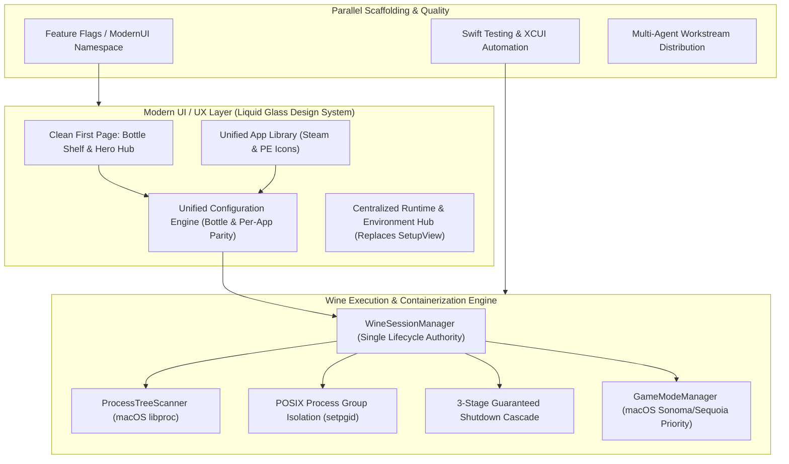
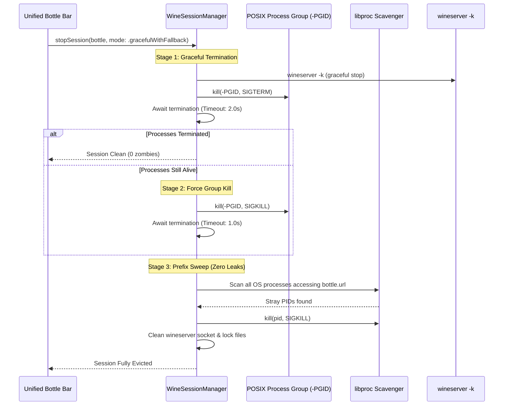
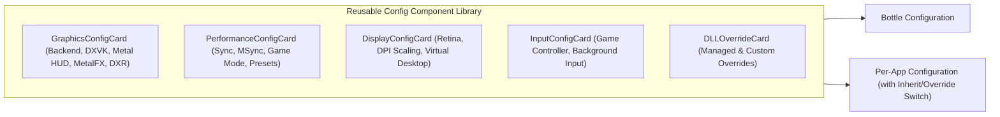
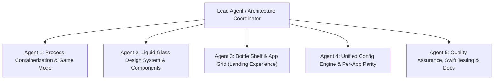

# Whisky Modernization Master Plan
## Architecture, Design System, Process Containerization & Multi-Agent Execution Strategy

---

## Executive Summary

Whisky has grown into one of the most beloved tools for running Windows applications and DirectX games on Apple Silicon. However, its rapid growth has introduced technical and user experience debt:
- **UI/UX Inconsistencies**: Duplicated "Stop Bottle" buttons in competing views, disjointed layouts, random sidebar collapsing behaviors, and a stark visual contrast between bottle-level settings and per-application overrides.
- **Missing Parity**: Key graphics options such as Metal HUD, MetalFX, and system Game Mode are accessible at the bottle level (or not at all) but completely missing from per-app configuration.
- **Fragmented Workflows**: The initial `SetupView` is an isolated modal wizard disconnected from bottle runtime management, creating redundant flows.
- **Process Leakage & Zombie Processes**: Process management relies on unmonitored `wineserver -k` calls and loose PID tracking, allowing background Wine helper processes (`wine64-preloader`, `services.exe`, child game threads) to linger indefinitely after a session terminates.
- **Lack of macOS Game Mode**: Wine game sessions do not trigger macOS Sonoma/Sequoia Game Mode, missing out on CPU/GPU priority and low-latency Bluetooth scheduling.

This Master Plan defines an end-to-end architectural and UX transformation. Inspired by the visual elegance and ergonomics of **Bottles (Linux)**, **CrossOver (macOS)**, and **Highball**, Whisky will adopt a unified **Liquid Glass** design system, a deterministic **Containerized Wine Process Engine**, full **Per-App Configuration Parity**, and a modular, **multi-agent parallel scaffolding architecture** ensuring the current client remains stable and buildable at all times.

---

## Architectural Pillars

---

## 1. Process Management & Containerization Architecture

### Current Problem
- `Wine.killBottle` invokes `runWineserver(["-k"], bottle: bottle)` inside an unmonitored background `Task`.
- If a game or background helper (`services.exe`, `winedevice.exe`, `explorer.exe`) hangs, `wineserver -k` silently times out or ignores unresponsive threads.
- `ProcessRegistry` only records the root PID launched by `Wine.runProgram`. It lacks visibility into descendants spawned by Wine or detached helper daemons.
- Result: Orphaned Wine processes consume CPU and RAM indefinitely, necessitating manual terminal kills.

### Modern Architecture: `WineContainer` & `WineSessionManager`

#### Core Components to Build:
1. **`POSIXProcessGroup`**:
   - Every Wine launch executes inside its own POSIX Process Group (`setpgid(0, 0)` or `posix_spawnattr_setpgroup`).
   - Signals sent to `-pgid` simultaneously reach wineserver, the game binary, and all child processes.
2. **`ProcessTreeScavenger` (using `libproc`)**:
   - Interfaces with `proc_listpids` and `proc_pidinfo` to inspect process parentage and open file descriptors.
   - Any process holding an open descriptor or memory map inside `<bottleURL>` is identified as belonging to the bottle prefix, regardless of how it was spawned.
3. **Deterministic 3-Stage Shutdown Protocol**:
   - **Stage 1 (Graceful)**: `wineserver -k` + `kill(-pgid, SIGTERM)` with a 2-second deadline.
   - **Stage 2 (Force Termination)**: If any process in the tree remains alive after the deadline, issue `kill(-pgid, SIGKILL)` to the entire process group.
   - **Stage 3 (Scavenge & Sweep)**: Inspect `libproc` for any stray prefix-locking processes, issue direct SIGKILL, and delete stale wineserver socket endpoints (`/tmp/.wine-<uid>/server-*`).
> **Status note on process group isolation.** `POSIXProcessGroup`,
> `ProcessTreeScavenger`, `WineSessionManager` and `GameModeManager` are built,
> and `Wine.runProgram` now registers each attached run with the session
> manager, so the lifecycle authority sees live sessions and the scavenger
> resolves their descendants.
>
> Stage 2's group escalation is however **inert by design for now**: Foundation's
> `Process` exposes no `setpgid`/`POSIX_SPAWN_SETPGROUP`, so a launched Wine
> process inherits *Whisky's own* process group. `kill(-pgid, SIGKILL)` on that
> group would kill the app, so `POSIXProcessGroup.isolatedGroupID(for:)` refuses
> to record a group that is not isolated from ours, and `sendSignalToGroup`
> refuses to signal it. Stage 2 therefore falls back to per-PID SIGKILL, which
> the scavenger's descendant expansion already covers. Real group isolation
> requires replacing `Process` in `Wine.startProcess` with a `posix_spawn` that
> sets `POSIX_SPAWN_SETPGROUP`; that is the remaining Phase 1 work.

4. **macOS Game Mode Integration (`GameModeManager`)**:
   - macOS Sonoma (14.0+) and Sequoia (15.0+) provide **Game Mode** for prioritizing GPU and CPU performance while minimizing Bluetooth audio/controller latency.
   - `GameModeManager` coordinates game session activation:
     - Wraps game execution with proper bundle category metadata (`LSApplicationCategoryType` = `public.app-category.games`)
       and the Game Mode support declaration (`LSSupportsGameMode` / `GCSupportsGameMode`), in Whisky's own `Info.plist`
       **and** in every shortcut bundle `ShortcutCreator` writes — the shortcut, not Whisky, is the bundle a game is
       launched from.
     - Holds a `latencyCritical` activity for the length of the session, reference counted per bottle. This is the half of
       Game Mode's behaviour Whisky controls: App Nap, timer coalescing and idle sleep stay out of the way.
     - Reports why a session is ineligible (`GameModeManager.Eligibility`) rather than failing silently.
     - Offers an automatic per-app and bottle-level "macOS Game Mode" toggle in configuration. The per-app override is
       wired; a bottle-level default is still Phase 4 work, so the override currently falls back to off.

   > **Deviation from the original plan:** the plan called for coordinating with `gamepolicyctl`. No such tool ships on
   > macOS and it is not a public interface, so nothing invokes it. macOS decides on its own when Game Mode engages —
   > there is no API to force it — which is why `GameModeManager` owns the preconditions and the scheduling instead.

---

## 2. UI / UX Overhaul & Liquid Glass Design System

### Visual Identity Comparison
| Dimension | Current Whisky | Target Modern Experience (Inspired by Bottles & CrossOver) |
| :--- | :--- | :--- |
| **Landing View** | Dull sidebar list with minimal stats; blank or disconnected state. | **Clean First Page**: Fluid Bottle Shelf with rich interactive cards, status indicators, and quick launches. |
| **Bottle Interior** | Fragmented 4-stage list (`BottleStage`: config, programs, processes, gameConfigs) + awkward bottom bar. | **Unified Hub**: Dynamic Hero header, high-res app grid, contextual action pills, and integrated tabs. |
| **Stop Bottle Action** | Duplicated across sidebar warning, running process table (2 buttons), and config alerts. | **Single Source of Truth**: Unified Bottle Status pill in the header toolbar with single Stop / Force Stop action. |
| **App Overrides** | Cluttered accordion view, different layout from Bottle config, missing Metal HUD and Game Mode. | **Visual & Feature Parity**: Exact same modular cards as Bottle settings, with clean Inherited vs Overridden toggles. |
| **Setup Experience** | Modal dialog popping up randomly; separate from runtime picker in config. | **Runtime Hub**: Integrated into Settings and Bottle creation; eliminates the standalone Setup wizard. |
| **Sidebar Ergonomics** | Random, non-centered toggle buttons and unstable widths. | **Fluid Split-View**: Centered macOS navigation sidebar with collapsible sections and fluid animations. |

---

## 3. Screen-by-Screen Redesign Specifications

### A. Clean First Page: The Bottle Shelf (`ModernBottleShelfView`)
- **Hero Shelf Layout**:
  - Displays bottles as polished glass cards featuring:
    - Custom bottle avatar or Windows version badge (Windows 11 / 10).
    - Status beacon (Active / Idle / Stopped).
    - Running process count with live pulse animation.
    - Quick-action buttons: Run Executable, Open C: Drive, Terminal, Settings.
  - Pinned Games row at the top with artwork tiles.
- **Empty State**:
  - Elegant onboarding graphic, "Create Your First Bottle" action, and automatic detection of existing bottles from previous installations or CrossOver prefixes.

### B. Unified Bottle Workspace (`ModernBottleDetailView`)
- Replaces the outdated `BottleStage` navigation stack with a cohesive workspace:
  - **Header Bar**: Bottle title, Windows version pill, Graphics Backend badge, and a **Single Lifecycle Control** (Live Status / Stop Session).
  - **Main Content Tabs**:
    1. **Applications**: Grid of installed Windows executables and Steam games with extracted high-res icons and GameDB ratings.
    2. **Configuration**: The centralized settings hub.
    3. **Active Processes**: Real-time process tree showing CPU, Memory, and parent-child hierarchy with targeted per-process termination.
    4. **Tools**: Winetricks, Registry Editor, Wine Configuration (`winecfg`), and Diagnostics.

### C. Unified Configuration Engine & Per-App Parity (`ConfigComponents`)
The configuration system will be refactored into a reusable component library used identically by **Bottle Settings** and **Program Overrides**:

#### New Features Brought to Per-App Configuration:
1. **Metal HUD Toggle**: Directly overrideable per application.
2. **MetalFX & Frame Generation**: Configurable per title.
3. **macOS Game Mode Toggle**: Enable/disable automatic Game Mode per application.
4. **DXR / Ray Tracing Override**: Per-title activation.
5. **Retina & High-DPI Scaling**: Per-app DPI scaling overrides.

### D. Deprecation & Replacement of Setup Menu (`RuntimeEnvironmentHub`)
- Deprecate the modal `SetupView`, `WhiskyWineDownloadView`, and `RosettaView`.
- Create a unified **Runtimes & Engines** panel inside `SettingsView`:
  - Visual cards for installed engines (WhiskyWine, GPTK / D3DMetal, DXVK, MoltenVK).
  - One-click downloads, updates, and integrity verification.
  - Rosetta 2 status check with automatic inline remediation.
- Bottle Creation wizard directly selects from downloaded runtimes or triggers seamless background fetching without dropping a blocking modal sheet over the app.

---

## 4. Multi-Agent Workstream Distribution

To ensure rapid, clean, and isolated execution without breaking the existing codebase, development will be divided across 5 specialized subagents working on parallel modules:

### Agent Roles & Work Breakdown:

| Agent | Scope & Responsibilities | Key Deliverables |
| :--- | :--- | :--- |
| **Agent 1: Process & Session** | Process group isolation, `libproc` scavenger, guaranteed kill cascade, `GameModeManager`. | `WineContainer.swift`, `ProcessTreeScavenger.swift`, `GameModeManager.swift`, container test suite. |
| **Agent 2: Design System** | Liquid Glass component library, cards, hero headers, unified action pills, typography tokens. | `WhiskyDesignSystem/`, `GlassCard.swift`, `HeroHeader.swift`, `StatusBeacon.swift`. |
| **Agent 3: Bottle Shelf & Hub** | The "Clean First Page", interactive bottle shelf, modern application grid with artwork integration. | `ModernBottleShelfView.swift`, `ModernBottleDetailView.swift`, `AppGridCard.swift`. |
| **Agent 4: Unified Config & Parity** | Shared configuration cards, per-app Metal HUD/Game Mode override, runtime hub migration. | `UnifiedGraphicsConfigCard.swift`, `ProgramOverrides+Parity.swift`, `RuntimesHubView.swift`. |
| **Agent 5: Testing & QA** | Swift Testing unit tests, process termination fuzzing, XCUI automation, developer documentation. | Comprehensive test suites under `WhiskyKitTests` and `WhiskyTests`. |

---

## 5. Phased Execution Roadmap

### Phase 1: Process Containerization & Lifecycle Authority (Foundation)
- Implement `POSIXProcessGroup` and attach process group IDs to all Wine launches.
- Implement `ProcessTreeScavenger` utilizing macOS `libproc` to identify all descendant and prefix-locking PIDs.
- Implement `WineSessionManager` with the 3-stage guaranteed shutdown protocol (Graceful -> SIGKILL -> Prefix Scavenge).
- Eliminate duplicate stop buttons across the current UI; route all stop requests through `WineSessionManager`.
- Build `GameModeManager` to negotiate macOS Game Mode during game sessions.
- **Validation**: Automated unit tests verifying 100% process elimination (zero lingering wine processes) under simulated game hangs and SIGKILL conditions.

### Phase 2: Design System & Core Component Foundation
- Establish `WhiskyDesignSystem` module/namespace adhering to macOS Human Interface Guidelines and Liquid Glass aesthetics.
- Implement reusable UI components: `GlassCard`, `MetricBadge`, `HeroHeader`, `SegmentedPillPicker`, and `UnifiedToggleRow`.
- Build previews for light/dark mode and various macOS display densities.
- **Validation**: Swift UI previews and component snapshot tests.

### Phase 3: Modern Landing Page & Bottle Overview ("Clean First Page")
- Construct `ModernBottleShelfView` providing the clean, visual bottle shelf.
- Implement interactive bottle cards with real-time status beacons, quick-action menus, and wine prefix stats.
- Build the modern application grid inside `ModernBottleDetailView` with high-resolution PE and Steam icons.
- Connect the unified lifecycle control pill in the bottle header.
- **Validation**: XCUI tests validating bottle switching, app launching, and responsive sidebar navigation.

### Phase 4: Unified Configuration Engine & Per-App Feature Parity
- Extract configuration sections into shared cards (`GraphicsConfigCard`, `PerformanceConfigCard`, `DisplayConfigCard`, `InputConfigCard`).
- Update `ProgramOverrides` in `WhiskyKit` to include `metalHud`, `metalFX`, `gameMode`, and custom DPI scaling.
- Rebuild `ProgramOverrideSettingsView` to mirror `ConfigView` with clean Inherit / Override toggles.
- Add Metal HUD and Game Mode controls to both Bottle and Per-App settings.
- **Validation**: Unit tests verifying serialization, copy-on-enable defaults, and environment variable generation for all new override keys.

### Phase 5: Runtime Hub Integration & Deprecation of Setup Modal
- Build `RuntimesHubView` directly inside `SettingsView` and integrate it into the Bottle Creation workflow.
- Deprecate standalone `SetupView` modal sheets, replacing them with inline progress cards and non-blocking background runtime fetchers.
- Integrate Rosetta 2 verification directly into the system checks panel.
- **Validation**: Fresh installation tests ensuring clean bootstrapping without modal interruption.

### Phase 6: Quality Assurance, Full Test Suite & Migration Cutover
- Run complete test suites (Swift Testing + XCUIAutomation).
- Conduct memory leak and zombie process stress-testing under heavy game launches.
- Enable `ModernUI` as default experience while preserving fallback toggles.
- Finalize documentation and release notes.

---

## 6. Verification Plan & Acceptance Criteria

### Process Management & Containerization
- [ ] Launching any program (standalone exe, installer, or Steam game) registers all descendant PIDs in `ProcessTreeScavenger`.
- [ ] Stopping a bottle from the unified status control terminates all `wine64-preloader`, `wineserver`, and helper processes within 3 seconds.
- [ ] Zero lingering processes verified via `pgrep -i wine` and `pgrep -i wineserver` after session shutdown.
- [ ] Game Mode engages upon launching a verified game and releases upon termination.

### UI / UX & Parity
- [ ] Home page displays the modern, clean bottle shelf with zero visual clutter.
- [ ] Exactly one unified lifecycle control per bottle, eliminating all duplicate stop buttons.
- [ ] Per-app configuration matches bottle configuration visually and supports Metal HUD, MetalFX, and Game Mode overrides.
- [ ] Setup modal is fully removed; runtime installation and updates are managed cleanly in the Runtime Hub.
- [ ] Sidebar navigates fluidly without awkward jumps or misaligned controls.

### Reliability & Tests
- [ ] All new logic accompanied by Swift Testing unit tests with >85% code coverage.
- [ ] Project compiles cleanly with zero warnings under Xcode's build system.
